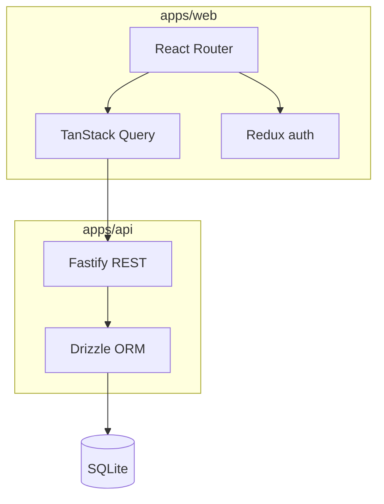

# Project Manager

Kanban-style project and task manager — portfolio pet project (React + Fastify + SQLite).

## Demo

| Environment | URL |
|-------------|-----|
| **Web** | _Deploy to Vercel — set `VITE_API_URL` to your API_ |
| **API** | _Deploy to Render — see [DEPLOY.md](docs/DEPLOY.md)_ |

**Demo login (after seed):** `demo@demo.com` / `demo123456`

## Architecture



| Layer | Stack |
|-------|--------|
| Web | React 18, Vite, TanStack Query, Redux Toolkit, Blueprint.js |
| API | Fastify, Drizzle ORM, SQLite, Zod |
| Shared | `packages/shared` — Zod schemas, DTOs, `ApiError` |

## Requirements

- Node.js **>= 20.6** (`.nvmrc` → `lts/*`) — API loads `apps/api/.env` via native `node --env-file`
- No Docker for local dev

**Env files:** API uses `apps/api/.env` (copy from `.env.example`). Web uses Vite’s `apps/web/.env.development` automatically. `.dev.vars` is for Cloudflare Workers and is not used here.

## Quick start

```bash
cp apps/api/.env.example apps/api/.env

npm install
npm run db:migrate
npm run db:seed
npm run dev
```

| Service | URL |
|---------|-----|
| Web | http://localhost:5173 |
| API | http://localhost:3000 |
| Health | http://localhost:3000/health |

## Scripts

| Command | Description |
|---------|-------------|
| `npm run dev` | API + Web |
| `npm run build` | Build all workspaces |
| `npm run lint` | Lint all workspaces |
| `npm run test` | Unit tests (api + web) |
| `npm run db:migrate` | Apply SQL migrations |
| `npm run db:reset` | Delete DB file + migrate (fix schema drift) |
| `npm run db:seed` | Demo user + projects |

## Tests

| Suite | Count | Command |
|-------|-------|---------|
| API (Vitest + supertest) | 9 | `npm run test -w @project-manager/api` |
| Web (Vitest + RTL) | 8 | `npm run test -w @project-manager/web` |

## Docs

- [Pet refactor design](docs/specs/pet-refactor-design.md)
- [Deployment](docs/DEPLOY.md)
- [ADR 001 — State management](docs/adr/001-state-management.md)
- [ADR 002 — Auth cookies](docs/adr/002-auth-cookies.md)

## Roadmap

- [x] PR 0 — Monorepo, apiFetch, foundation
- [x] PR 1 — Auth (JWT cookies)
- [x] PR 2 — Projects + TanStack Query
- [x] PR 3 — Tasks, Kanban, comments
- [x] PR 4 — Polish, strictNullChecks, Error Boundary
- [x] PR 5 — Tests, ADR, deploy configs

## Screenshots

Add images under [`docs/screenshots/`](docs/screenshots/README.md) after deploy.
