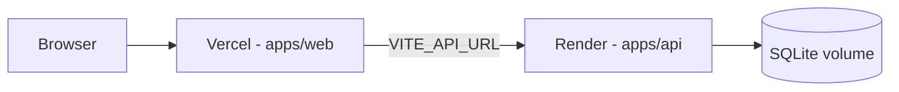

# Deployment guide

## Architecture (production)



## Web — Vercel

1. Import repo, set **Root Directory** to `apps/web`.
2. Build command: `npm run build` (from monorepo root: `cd ../.. && npm ci && npm run build -w @project-manager/web`).
3. Output: `apps/web/dist`.
4. Environment:

| Variable | Example |
|----------|---------|
| `VITE_API_URL` | `https://your-api.onrender.com` |

`apps/web/vercel.json` handles SPA routing.

## API — Render (Web Service)

1. New **Web Service**, monorepo, root `apps/api` or build from repo root.
2. Build: `npm ci && npm run build -w @project-manager/api`
3. Start: `npm run start -w @project-manager/api` (runs `prestart` → Drizzle migrate).
4. Attach a **persistent disk** mounted at `/data` (or your path).
5. Environment:

| Variable | Example |
|----------|---------|
| `DATABASE_URL` | `file:/data/app.db` |
| `JWT_SECRET` | 32+ random chars |
| `COOKIE_SECRET` | 32+ random chars |
| `CORS_ORIGIN` | `https://your-app.vercel.app` |
| `NODE_ENV` | `production` |
| `PORT` | `3000` |

6. After first deploy: `npm run db:seed -w @project-manager/api` via Render shell (one-time).

See `render.yaml` for a blueprint starter.

## Local production smoke

```bash
npm run build
DATABASE_URL=file:./data/app.db npm run db:migrate -w @project-manager/api
npm run start -w @project-manager/api
npm run preview -w @project-manager/web
```

## Before release

```bash
npm run build
npm run test
```
