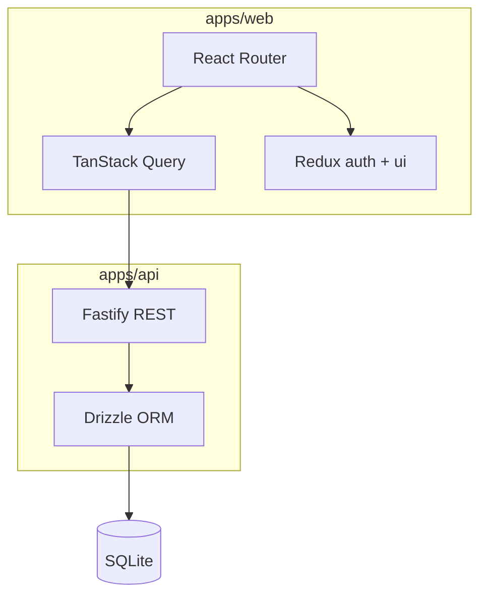

# Pet refactor design — Project Manager

Учебный Kanban → portfolio pet-project. Цели: **A** (frontend-портфолио) + **D** (тренировка к Middle).

---

## Goals

| Цель | Критерий готовности |
|------|---------------------|
| **A — Портфолио** | Demo URL, README со скринами, архитектурная схема, CI badge |
| **D — Middle** | Strict TS, тесты, единый data layer, ADR, code review quality |

---

## Stack (зафиксировано)

| Layer | Choice |
|-------|--------|
| Monorepo | npm workspaces: `apps/web`, `apps/api`, `apps/legacy-backend`, `packages/shared` |
| Node | `>=20`, `.nvmrc` → `lts/*`, CI → `lts/*` |
| Web | React 18, Vite, TypeScript strict (+ `strictNullChecks` в PR 4), Blueprint.js |
| Server state | TanStack Query |
| Client state | Redux Toolkit — `authSlice` (user snapshot) + `uiSlice` |
| HTTP | Native `fetch` via `apiFetch` (`credentials: include`) — **без axios** |
| API | Fastify, Drizzle ORM, SQLite, Zod |
| Shared | `packages/shared` — Zod schemas, DTO, `ApiError` |
| Auth | JWT в httpOnly cookies, `GET /auth/me` — токены не в Redux/localStorage |
| Versions | `^` в package.json, lockfile в git, без patch-pin без причины |

---

## Architecture



### State boundaries

| Данные | Где | Запрещено |
|--------|-----|-----------|
| projects, tasks, comments | TanStack Query only | Redux slices с server lists |
| user (id, name, email, avatar) | Redux `authSlice` | `password`, JWT в store |
| session / tokens | httpOnly cookies (API) | `localStorage` token, `FAKE_TOKENS` |
| dialogs, UI flags | Redux `uiSlice` (optional) | — |

---

## API v1 scope

### Auth
- `POST /auth/register`
- `POST /auth/login`
- `POST /auth/logout`
- `GET /auth/me`
- `PATCH /auth/me` (name, avatarUrl)
- `PATCH /auth/password`

### Projects (owner only)
- `GET /projects`
- `POST /projects`
- `GET /projects/:id`
- `PATCH /projects/:id`
- `DELETE /projects/:id`

### Tasks
- `GET /projects/:projectId/tasks`
- `POST /projects/:projectId/tasks`
- `GET /tasks/:id` (detail + comments)
- `PATCH /tasks/:id` (status, fields)
- `DELETE /tasks/:id`

### Comments
- `GET /tasks/:taskId/comments`
- `POST /tasks/:taskId/comments`
- `DELETE /comments/:id` (author only)

### Infra
- `GET /health`
- `GET /health/db`

### Out of scope v1
- File upload (multipart) — UI stub «скоро»
- RBAC / assignee на другого user
- Realtime Kanban
- OAuth / email verification

---

## Roadmap (overview)

| Phase | PR | Неделя* | Фокус | Статус |
|-------|-----|---------|-------|--------|
| Foundation | PR 0 | 1 | Monorepo, SQLite + Drizzle, apiFetch, API health, CI | ✅ Done |
| Auth | PR 1 | 1 | JWT cookies, authSlice, login flow | ✅ Done |
| Projects | PR 2 | 1 | REST + TanStack Query, убрать project Redux | ✅ Done |
| Tasks | PR 3 | 1–2 | Kanban, comments, убрать task Redux | ✅ Done |
| Polish | PR 4 | 1 | Profile, баги, strictNullChecks, UX | ✅ Done |
| Quality | PR 5 | 1 | Тесты, deploy, README, ADR | ✅ Done |
| v2 | PR 6+ | — | Optimistic DnD, files, Storybook | 🔲 Backlog |

\*Ориентировочно при part-time; буфер +1 неделя на непредвиденное.

---

## PR checklist (детально)

### PR 0 — Foundation ✅

**Цель:** репозиторий выглядит как pet, не lab.

**Сделано:**
- [x] Monorepo: `apps/web`, `apps/api`, `apps/legacy-backend`, `packages/shared`
- [x] `apiFetch` + удалён axios
- [x] Drizzle schema + SQLite + seed
- [x] Fastify: `/health`, `/health/db`, env validation (Zod)
- [x] CI: lint + build + api test
- [x] README, `.env.example`, design doc
- [x] Версии: `engines >=20`, `^` deps, lockfile

**Exit:** `npm run dev` поднимает stack; `npm run build` green.

---

### PR 1 — Auth end-to-end ✅

**Цель:** реальная сессия, без fake auth.

**API:**
- [x] `POST /auth/register`, `POST /auth/login`, `POST /auth/logout`
- [x] `GET /auth/me`, `PATCH /auth/me`, `PATCH /auth/password`
- [x] bcrypt для паролей
- [x] JWT access + refresh в httpOnly cookies (`sameSite`, `secure` в prod)
- [x] `requireAuth` middleware (+ refresh при истёкшем access)
- [x] Rate limit на `/auth/login`

**Web:**
- [x] `authSlice`: `{ user, status, error }` — без `token`, `password`, `isAuthenticated`
- [x] `AuthBootstrap`: `GET /auth/me` на старте
- [x] `ProtectedRoutes` по `status`
- [x] Login / Register
- [x] Logout → `POST /auth/logout` + `clearAuth`
- [x] Удалены: `fakeLoginApi`, `FAKE_TOKENS`, `api/authApi.ts`
- [x] Legacy projects/tasks → `VITE_LEGACY_API_URL` (8080)

**Shared:**
- [x] Zod: `loginSchema`, `registerSchema`, `UserDTO`

**Tests:**
- [x] API: supertest login → me, 401 без cookie
- [x] Web: authSlice unit tests

**Exit:** login `demo@demo.com` / `demo123456` → profile; refresh сохраняет сессию.

---

### PR 2 — Projects ✅

**Цель:** CRUD проектов через новый API + Query.

**API:**
- [x] Projects routes + owner checks
- [x] Seed: demo projects для demo user

**Web:**
- [x] `@tanstack/react-query` + `QueryClientProvider`
- [x] `features/projects`: `useProjects`, `useProject`, `useCreateProject`, …
- [x] Home: список, поиск, пагинация (`filteredProjects.length`)
- [x] `VITE_API_URL=http://localhost:3000`
- [x] Удалить: `context/actions/project/*`, project Redux slice

**Tests:**
- [x] API: CRUD + 403 для чужого project
- [ ] Web: MSW или integration list + create (отложено)

**Exit:** проекты без json-server; legacy backend не нужен для Home.

---

### PR 3 — Tasks + Kanban + Comments ✅

**Цель:** полный flow проект → board → задача → комментарий.

**API:**
- [x] Tasks + comments routes
- [x] Вложенные проверки доступа через project owner

**Web:**
- [x] `features/tasks`: hooks для board, detail, comments
- [x] Kanban: DnD → `PATCH /tasks/:id` (pessimistic v1; optimistic — v2)
- [x] Loading per-column (не глобальный `tasks.loading`)
- [x] TaskDetail: fix status form (`onSubmit` vs `handleStatusSubmit`)
- [x] TaskComments: fix `errors.comment`, `await` mutations
- [x] Удалить: `context/actions/task/*`, task Redux slice

**Tests:**
- [x] API: tasks CRUD + comments + 403
- [ ] Playwright smoke (не используем — по решению)

**Exit:** end-to-end без legacy API.

---

### PR 4 — Profile + Polish ✅

**Цель:** стабильный UX, Middle-сигналы в коде.

**Web:**
- [x] Profile: `PATCH /auth/me`, смена пароля с `await` + error handling
- [x] `ButtonWithDialogForm`: `await onSubmit`, close dialog on success only
- [x] `ToasterProvider`: не блокировать весь UI (`return null`)
- [x] `Link` вместо `<a href>` (TaskList, NotFound)
- [x] Стабильные `key={task.id}`
- [x] `strictNullChecks: true` + `getErrorMessage` для catch
- [x] Error Boundary + централизованный handler 401 в `apiFetch`
- [x] Удалить `apps/legacy-backend` из `npm run dev`

**API:**
- [x] Валидация body через shared Zod schemas (auth, projects, tasks)

**Exit:** нет известных P0/P1 багов из аудита; lint + build green.

---

### PR 5 — Quality + Deploy ✅

**Цель:** portfolio-ready.

- [x] Тесты: ≥8 meaningful (api supertest + web RTL)
- [x] `docs/adr/001-state-management.md` (Query + Redux)
- [x] `docs/adr/002-auth-cookies.md`
- [x] README: architecture diagram, deploy section, screenshots placeholder
- [x] Deploy: Vercel (`vercel.json`) + Render (`render.yaml`, `docs/DEPLOY.md`)
- [x] `prestart` → Drizzle migrate on API boot
- [x] Dependabot (`.github/dependabot.yml`)
- [ ] `npm audit` в CI (CI removed by choice; run locally: `npm audit --audit-level=high`)

**Exit:** deploy configs + docs ready; add public demo URLs after first deploy.

---

### PR 6+ — Backlog (v2)

| PR | Содержание |
|----|------------|
| PR 6 | Optimistic updates для Kanban DnD |
| PR 7 | File attachments (S3/local + metadata) |
| PR 8 | Storybook для `shared/ui` |
| PR 9 | Lazy routes, bundle split Blueprint icons |
| PR 10 | Assignee picker + users list (RBAC light) |

---

## Folder structure (target)

```text
apps/web/src/
  app/              # providers, router, store
  features/
    auth/
    projects/
    tasks/
  entities/         # types, mappers
  shared/
    api/client.ts   # apiFetch
    ui/             # Blueprint wrappers
  store/
    slices/authSlice.ts
    slices/uiSlice.ts

apps/api/src/
  config/env.ts
  lib/db.ts
  db/schema.ts
  middleware/requireAuth.ts
  routes/
  services/

packages/shared/src/
  schemas/
  types/
  api-error.ts
```

---

## Environment

| Variable | App | Description |
|----------|-----|-------------|
| `DATABASE_URL` | api | SQLite path (`file:./data/app.db`) |
| `JWT_SECRET` | api | min 32 chars |
| `COOKIE_SECRET` | api | min 32 chars |
| `CORS_ORIGIN` | api | e.g. `http://localhost:5173` |
| `PORT` | api | default `3000` |
| `VITE_API_URL` | web | e.g. `http://localhost:3000` |

---

## Scripts (root)

| Command | Description |
|---------|-------------|
| `npm run dev` | API + Web + legacy (до PR 4) |
| `npm run dev:stack` | API + Web only |
| `npm run build` | Build all workspaces |
| `npm run lint` | Lint all workspaces |
| `npm run test` | Test all workspaces |
| `npm run db:migrate` | Apply Drizzle SQL migrations (api) |
| `npm run db:push` | Drizzle push schema — dev only (api) |
| `npm run db:seed` | Seed demo data (api) |

---

## Deprecated / remove timeline

| Item | Remove in |
|------|-----------|
| axios, `axiosInstance` | PR 0 ✅ |
| `FAKE_TOKENS`, `fakeLoginApi` | PR 1 |
| json-server in web deps | PR 0 ✅ |
| `context/actions/project/*` | PR 2 |
| `context/actions/task/*` | PR 3 |
| `apps/legacy-backend` | PR 4 |
| `strictNullChecks: false` | PR 4 |

---

## Definition of Done (pet v1)

- [ ] Demo deployed and linked in README
- [ ] Auth via cookies, no secrets in repo
- [ ] TanStack Query for all server data
- [ ] Redux only for auth user + UI
- [ ] CI green: lint, build, test
- [ ] ≥8 tests
- [ ] 2 ADR documents
- [ ] No critical bugs from lab audit (postComment catch, pagination, forms await)

---

## References

- [Root README](../../README.md)
- ADR (planned): `docs/adr/001-state-management.md`, `docs/adr/002-auth-cookies.md`
